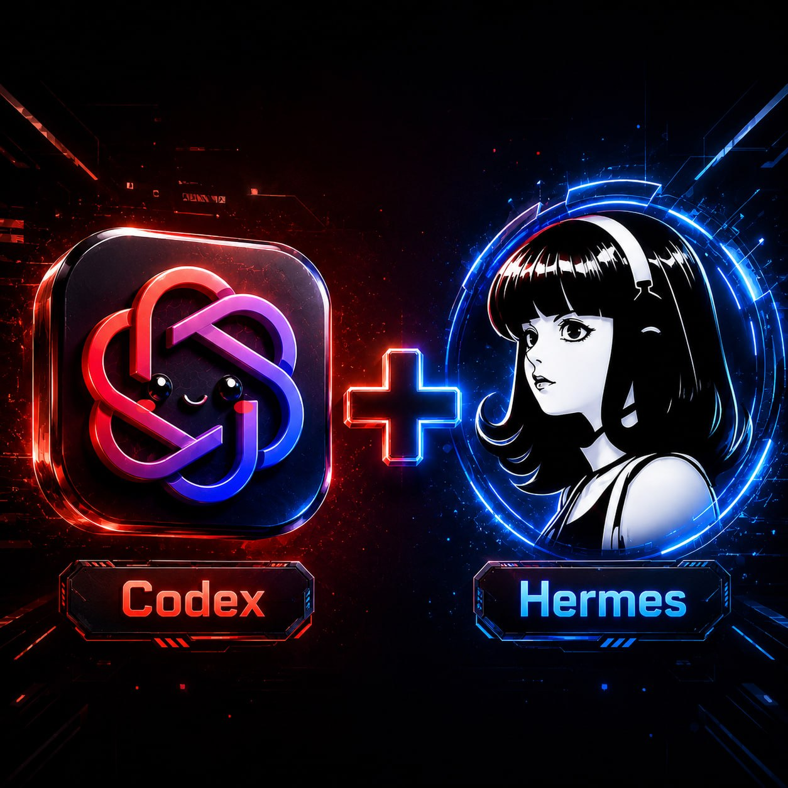

# Codex + Hermes Team



**Give Codex a specialist Hermes Agent team through MCP.**

`codex-plus-hermes-team` is a local MCP server that lets Codex, Claude Code, Cursor, and other MCP-capable assistants consult a configured team of [Hermes Agent](https://hermes-agent.nousresearch.com/docs) profiles.

Codex remains the working interface and final integrator. Hermes profiles act as specialists: they keep their own roles, memory, tools, skills, boundaries, and optional durable Kanban workflows.

```text
User
  -> Codex / Claude Code / Cursor
    -> Codex + Hermes Team MCP server
      -> Hermes CLI
        -> Hermes profiles
        -> optional Hermes Kanban
        -> specialist answers and task reports
```

## What it does

- Discovers local Hermes profiles.
- Maintains a configurable team registry with roles and capabilities.
- Routes tasks to likely specialists with confidence and reasons.
- Asks one Hermes profile for focused specialist input.
- Asks a panel of profiles and returns structured agreement, disagreement, risks, evidence, and next actions.
- Creates and reads optional durable Hermes Kanban tasks.
- Collects completed Kanban results into a clean Codex-facing summary.
- Carries a side-effect policy so specialist calls do not silently mutate files, deploy, post, buy, delete, or message externally.

## Who is this for?

This project is for builders who already use a coding assistant and want it to work with a persistent local agent team.

Good fit:

- developers using Codex, Claude Code, Cursor, or another MCP client;
- Hermes Agent users with multiple profiles;
- AI-agent operators who want specialist review, research, legal/finance/design/product lanes, or durable background tasks;
- teams that prefer local-first orchestration instead of uploading profile memory into one giant chat.

Not a fit:

- users who do not run Hermes Agent locally;
- people looking for a Codex model provider;
- teams that need a hosted dashboard out of the box;
- workflows that expect agents to perform external side effects without human approval.

## Tool surface

The MCP server exposes these tools:

- `hermes_team_health` — check Node, config, Hermes CLI availability, discovery, active agents, safety, and Kanban settings.
- `hermes_team_list_agents` — list configured and discovered Hermes profiles.
- `hermes_team_route` — select likely specialists with confidence, reasons, route mode, and score details.
- `hermes_team_ask_agent` — ask one Hermes profile in one-shot mode.
- `hermes_team_discover_roles` — ask profiles to describe their role, safe use cases, limits, and output style.
- `hermes_team_ask_panel` — ask several profiles and return structured synthesis buckets.
- `hermes_team_inspect_agent` — ask one profile to describe its own specialist lane.
- `hermes_team_create_task` — create a durable Hermes Kanban task.
- `hermes_team_get_task` — read a durable Hermes Kanban task.
- `hermes_team_collect_result` — collect task status, runs, final summary, and result signals.

## Install from source

```bash
git clone https://github.com/AlekseiUL/codex-plus-hermes-team.git
cd codex-plus-hermes-team
npm install
npm run build
npm install -g .
```

Requirements:

- Node.js 20 or newer;
- a local `hermes` command;
- at least one Hermes profile;
- an MCP-capable client.

## Configure

Create a starter config:

```bash
codex-plus-hermes-team init-config
```

By default this writes:

```text
~/.codex-plus-hermes-team/team.yaml
```

Edit it so profiles match your Hermes setup.

Minimal example:

```yaml
hermes:
  command: hermes
  defaultCwd: /path/to/your/project-or-team-root

discovery:
  enabled: true
  profilePrefix: "team-"

safety:
  defaultSideEffectPolicy: advice_only

agents:
  - profile: team-architect
    displayName: Architect
    role: architecture
    description: System design, decomposition, tradeoffs, implementation plans.
    capabilities: [architecture, planning, tradeoffs, system design]
```

Verify the install:

```bash
codex-plus-hermes-team doctor
```

`doctor` returns JSON with config path, Node version, Hermes health, configured agents, discovered agents, active agents, safety policy, and Kanban settings.

## Add to Codex

Example `config.toml` block:

```toml
[mcp_servers.hermes-team]
command = "codex-plus-hermes-team"

[mcp_servers.hermes-team.env]
CODEX_PLUS_HERMES_TEAM_CONFIG = "/absolute/path/to/team.yaml"
```

See [`examples/codex-config.example.toml`](examples/codex-config.example.toml).

## Add to Claude Code

Example MCP server config:

```json
{
  "mcpServers": {
    "hermes-team": {
      "command": "codex-plus-hermes-team",
      "env": {
        "CODEX_PLUS_HERMES_TEAM_CONFIG": "/absolute/path/to/team.yaml"
      }
    }
  }
}
```

See [`examples/claude-code-config.example.json`](examples/claude-code-config.example.json).

## Recommended client skill

Copy or reference [`skills/hermes-team/SKILL.md`](skills/hermes-team/SKILL.md) in your coding assistant instructions.

The skill teaches the assistant:

- when to ask Hermes;
- when to stay native;
- how to route to specialists;
- how to use panel mode;
- how to collect durable Kanban results;
- how to treat Hermes output as specialist input, not final truth.

## Usage patterns

Ask one specialist:

```text
Use hermes_team_ask_agent with profile=team-researcher.
```

Ask a panel:

```text
Use hermes_team_ask_panel for this product plan and synthesize disagreement.
```

Discover team roles:

```text
Use hermes_team_discover_roles to build a team map.
```

Create durable work:

```text
Use hermes_team_create_task for a long research task assigned to team-researcher.
```

Collect durable results:

```text
Use hermes_team_collect_result with the task id and integrate the summary into the final answer.
```

## Side-effect policy

Every specialist call can carry a side-effect policy:

- `advice_only` — default; specialists should only advise.
- `read_only` — reading and searching are allowed, writes are not.
- `local_files_allowed` — local file changes are allowed only when explicitly requested.
- `external_side_effects_need_approval` — prepare external actions, then ask before doing them.
- `external_side_effects_allowed` — external actions are allowed only when explicitly approved.

This is a guardrail, not a sandbox. Profiles with powerful tools should still have their own safety rules.

## Security and privacy

This bridge is local-first:

- MCP communication happens over stdio.
- The bridge calls your local `hermes` command.
- It does not expose an HTTP server.
- It does not upload profile memory, logs, prompts, or task databases by itself.
- Personal team configs belong in `*.local.yaml` or outside the repository.

Your Hermes profiles may still use remote model providers, external tools, or gateway integrations depending on your own Hermes configuration. Treat prompts and specialist outputs as sensitive and configure providers accordingly.

Do not commit real Hermes profiles, `.env` files, API keys, memories, sessions, logs, Kanban databases, or private absolute paths.

See [`SECURITY.md`](SECURITY.md) and [`docs/security.md`](docs/security.md).

## Development

```bash
npm install
npm test
npm run typecheck
npm run build
```

Local verification used for this repository:

```bash
npm test && npm run typecheck && npm run build
git diff --check
```

## Documentation

- [`docs/architecture.md`](docs/architecture.md) — internal architecture and tool modes.
- [`docs/product-strategy.md`](docs/product-strategy.md) — product philosophy, memory model, routing quality, and future features.
- [`docs/roadmap.md`](docs/roadmap.md) — MVP, next, and later work.
- [`docs/security.md`](docs/security.md) — local-first security and privacy model.
- [`docs/market-research.md`](docs/market-research.md) — related-work notes and positioning context.

## Canonical source

This project is maintained by Aleksei Ulianov / Sprut_AI.
Original repository: https://github.com/AlekseiUL/codex-plus-hermes-team

If you found this project mirrored, repackaged, or redistributed elsewhere, check this repository as the source of truth.

## Attribution

Where permitted by the applicable license, if you reuse, fork, modify, package, or publish this work, keep the original copyright and license notice and link back to the canonical repository.

## Public links

- YouTube: https://youtube.com/@alekseiulianov
- Telegram channel — Sprut AI: https://t.me/Sprut_AI
- Telegram chat — Sprut AI: https://t.me/+eH-qNIDmud8zNDZi
- AI Операционка: https://t.me/tribute/app?startapp=sJyg

## License

MIT — see [`LICENSE`](LICENSE).

---

# Codex + Hermes Team — русский


**Подключает к Codex команду специалистов Hermes Agent через MCP.**

`codex-plus-hermes-team` — локальный MCP-сервер. Он позволяет Codex, Claude Code, Cursor и другим MCP-клиентам обращаться к настроенной команде профилей Hermes Agent.

Codex остаётся рабочим интерфейсом и финальным интегратором. Hermes-профили работают как специалисты: у каждого своя роль, память, инструменты, skills, границы и при необходимости durable-задачи через Hermes Kanban.

## Что внутри

- discovery локальных Hermes-профилей;
- registry команды с ролями и capabilities;
- routing задач к подходящим специалистам;
- one-shot запрос к одному профилю;
- panel mode для нескольких профилей с нормальной структурой: согласие, расхождения, риски, evidence, next actions;
- optional durable-задачи через Hermes Kanban;
- сбор результата Kanban-задачи в чистый ответ для Codex;
- side-effect policy, чтобы агенты не делали внешние действия молча.

## Для кого

Подходит, если у тебя уже есть:

- Codex, Claude Code, Cursor или другой MCP-клиент;
- локальный Hermes Agent;
- несколько Hermes-профилей;
- желание дать coding assistant не один общий чат, а нормальную команду специалистов.

Не подходит, если нужен hosted dashboard, model provider для Codex или система, где агенты сами без разрешения публикуют, деплоят, покупают, удаляют или пишут людям.

## Быстрый старт

```bash
git clone https://github.com/AlekseiUL/codex-plus-hermes-team.git
cd codex-plus-hermes-team
npm install
npm run build
npm install -g .
```

Создать конфиг:

```bash
codex-plus-hermes-team init-config
```

Проверить установку:

```bash
codex-plus-hermes-team doctor
```

Добавить MCP server в Codex:

```toml
[mcp_servers.hermes-team]
command = "codex-plus-hermes-team"

[mcp_servers.hermes-team.env]
CODEX_PLUS_HERMES_TEAM_CONFIG = "/absolute/path/to/team.yaml"
```

## Главная идея

Один coding assistant хорош для локального исполнения. Команда агентов полезна там, где нужны специализация, память, проверка, исследование, риски и долгие задачи.

Этот bridge даёт простой контур:

```text
route -> ask -> compare -> verify -> synthesize -> optionally remember
```

Codex не обязан всё знать сам. Он может спросить нужного Hermes-специалиста, проверить ответ и вернуть пользователю один нормальный результат.

## Безопасность

По умолчанию политика — `advice_only`.

Для более сильных действий используются явные политики:

- `read_only`;
- `local_files_allowed`;
- `external_side_effects_need_approval`;
- `external_side_effects_allowed`.

Личные конфиги, реальные профили, память, логи, сессии, Kanban database, `.env` и ключи не должны попадать в репозиторий.

Важно: сам bridge не загружает память и промпты наружу, но ваши Hermes-профили могут использовать remote model providers, внешние tools или gateway integrations. Поэтому промпты и ответы специалистов всё равно надо считать чувствительными данными и настраивать провайдеры отдельно.

## Авторские ссылки

- YouTube: https://youtube.com/@alekseiulianov
- Telegram-канал Sprut AI: https://t.me/Sprut_AI
- Чат Telegram-канала Sprut AI: https://t.me/+eH-qNIDmud8zNDZi
- AI Операционка: https://t.me/tribute/app?startapp=sJyg

## Канонический источник

Проект поддерживает Aleksei Ulianov / Sprut_AI.
Оригинальный репозиторий: https://github.com/AlekseiUL/codex-plus-hermes-team

Если вы нашли этот проект в зеркале, репаке или чужой сборке, проверяйте оригинальный репозиторий как источник правды.

## Лицензия

MIT — см. [`LICENSE`](LICENSE).
